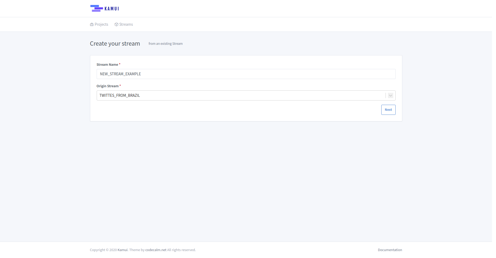
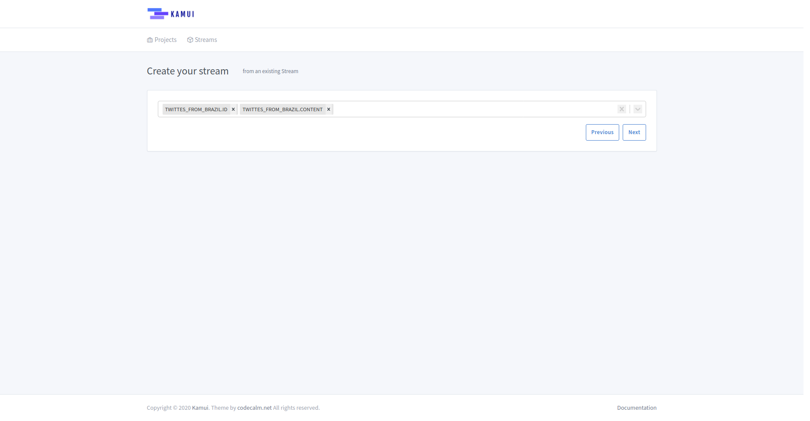
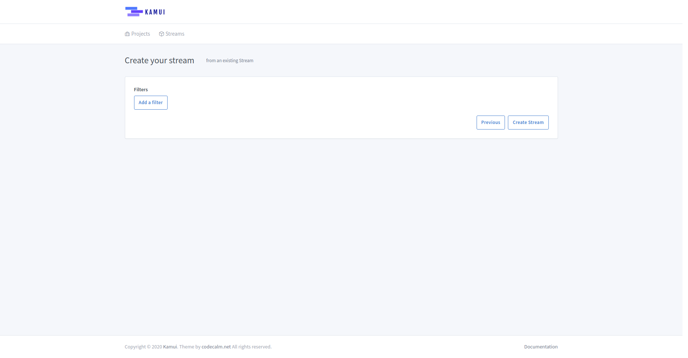
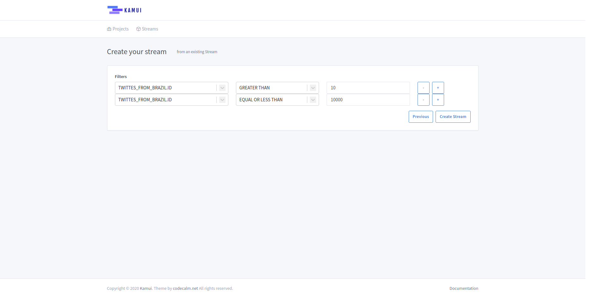

# Create stream from stream

To create a new stream you have to follow the steps described below.

## Basic Information

* **Stream Name**: The stream name should be unique or you'll get some errors
* **Origin Topic**: Select the Kafka Topic that you want from the dropdown list

## Desired Fields

* **Fields**: Select the desired fields to your stream from the dropdown list, you have to select at least one field to
continue

## Filters

In this step, you can create the stream filter.

You can create the stream without any filter:

Or create some filters to your stream:

!!! warning
    So far, we don't support the choice among *AND*, *OR* and *NOT* operators, all applied filters will be *"connected"*
    using *AND* operator!

---

Finally, click on the ***Create Stream*** button!
