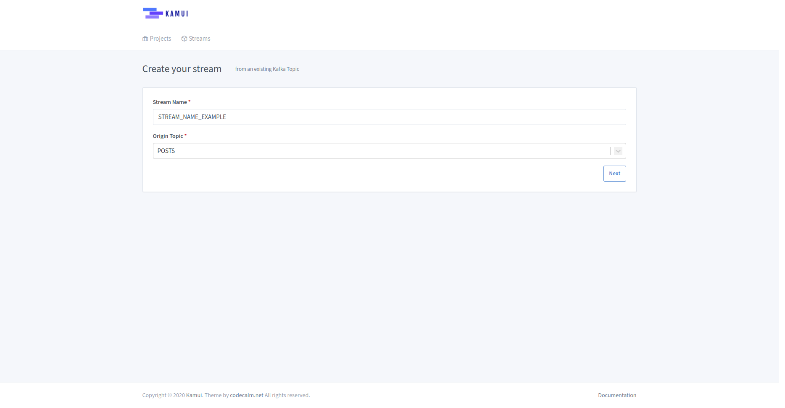
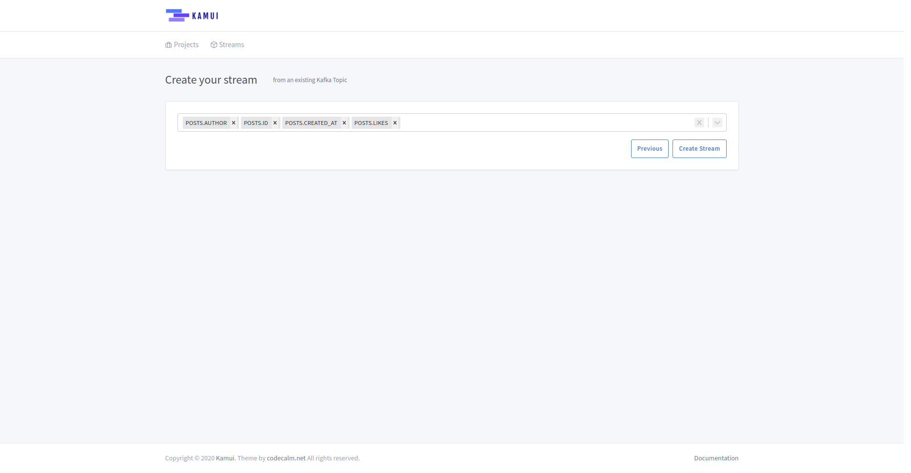

# Create stream from Topic

To create a new stream from a Kafka Topic we just have two steps!

## Basic information

* **Stream Name**: The stream name should be unique or you'll get some errors
* **Origin Topic**: Select the Kafka Topic that you want from the dropdown list

## Desired fields

* **Fields**: Select the desired fields to your stream from the dropdown list, you have to select at least one field to
continue

After your selection just click on the ***Create Stream*** button!
