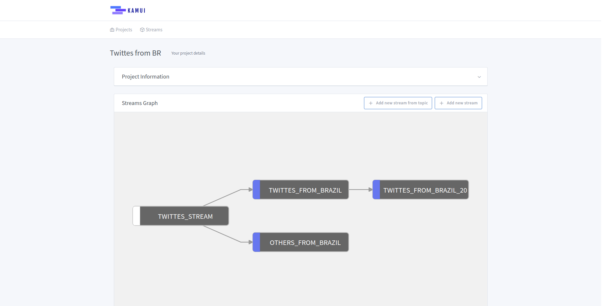
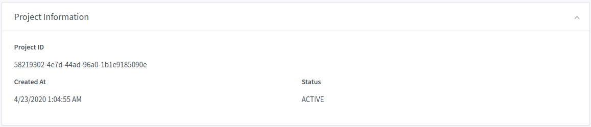
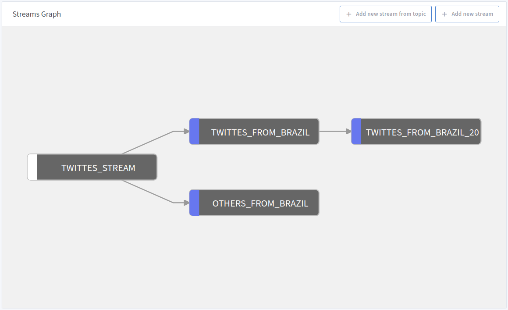
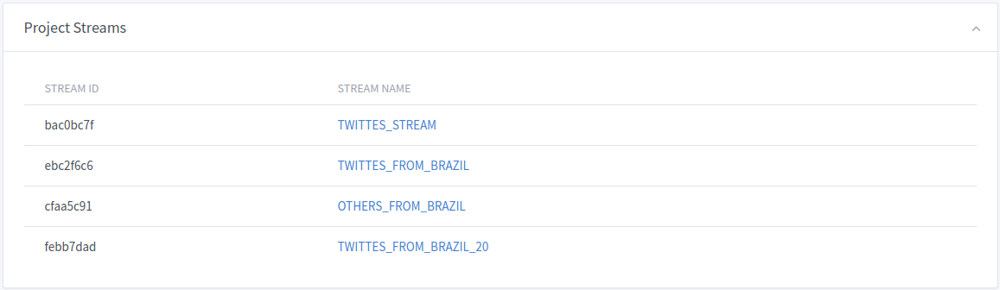

# Project Details

In the Project Details screen we can see some useful information and create new streams.

## Project Information

In this section, we can see the basics information about the project.

## Project Streams Graph

We can create new streams from a Kafka Topic or an existing stream and visualize the relations between them using the
``Streams Graph`` section.

!!! info
    As we can see in the image below, we have two **boxes** type:

    * With a **white** piece represents streams created from a Kafka Topic
    * With a **blue** piece represents streams created from an existing one

## Project Streams

Here we have a list of all streams inside the project.

