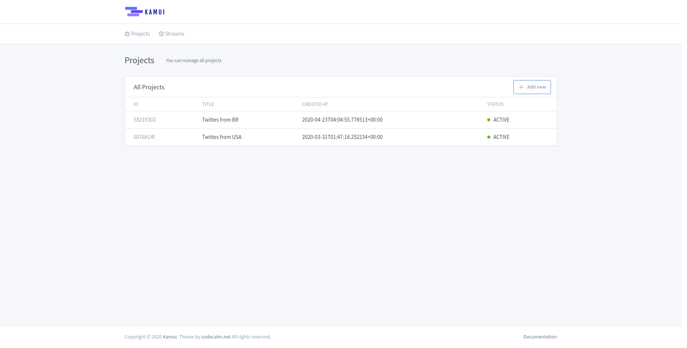
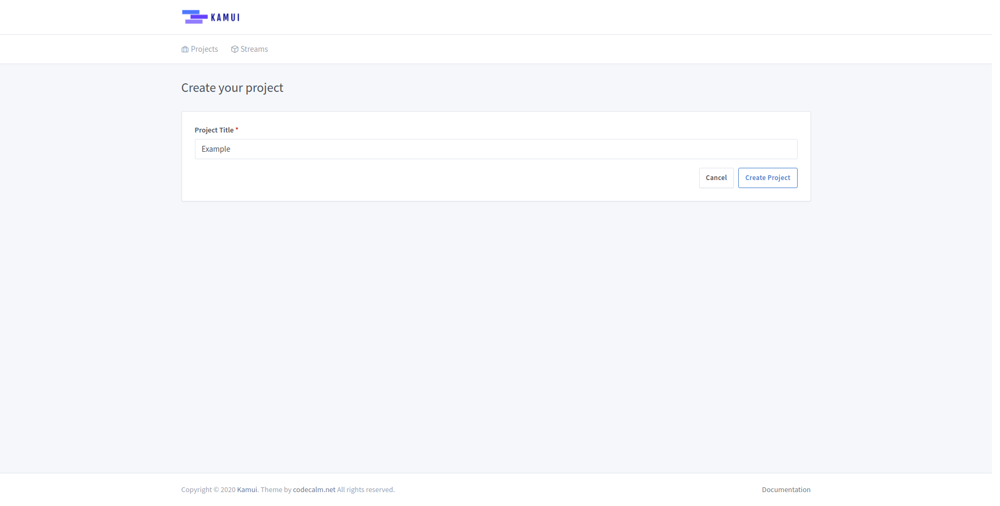

# Projects

## Overview

Projects inside ``Kamui`` are our macro streams visualization, they have a specific transformation context.

A project tries to apply the [Single Responsibility Principle](https://en.wikipedia.org/wiki/Single-responsibility_principle),
closing the streams context! The user is responsible to define the context and follow it.

## Create new Project

To create a new project we just have to give it a name.

