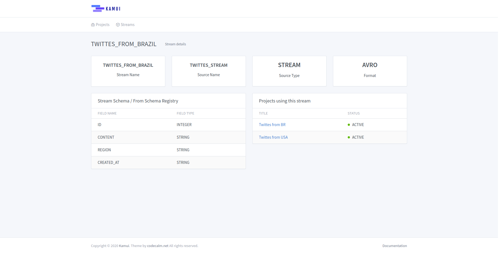
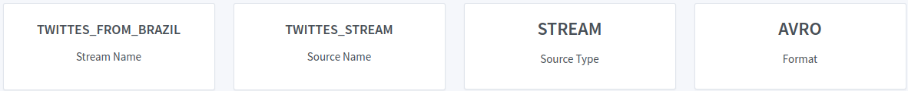
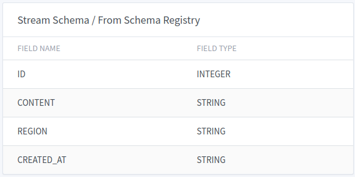
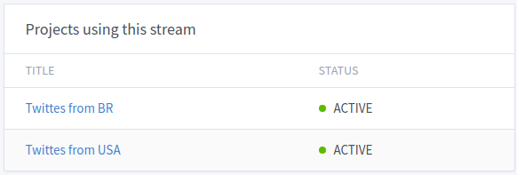

# Stream Details

In the Stream Details page we can see some useful information.

## General Information

In this first content row we have:

* **Stream Name**: The stream name that you created previously
* **Source Name**: The name of the stream source
* **Source Type**: The origin where the stream gets the data, it can be *TOPIC* or *STREAM*
* **Format**: The format that data is stored, so far, Kamui only uses *AVRO*

## Schema Information

In this section, we can see the available fields to use and their types.

## Projects Information

Here we can see all projects that use the stream.

